In this blog post, I'm going to describe my algorithm for procedural generation of 2D dungeon levels with a predefined structure. I won't go into implementation details today as I plan to make this into a series and cover it in the next post.

<BlogSeries slug={props.slug} />
<EdgarLinks />

## Background

The algorithm was written as a part of my [bachelor thesis](https://github.com/OndrejNepozitek/Edgar-DotNet/blob/text/bachelor_thesis.pdf) and is based on the previous work from Ma et al (2014). The goal of the thesis was to improve the speed of the algorithm and enhance it with new features. I'm quite satisfied with the result as we were able to make the algorithm fast enough to be used during game runtime. After finishing the thesis, we decided to transform it into a paper and submit it to the Game-ON 2018 conference.

## Algorithm

To produce a game level, the algorithm takes a set of polygonal building blocks (room templates) and a level connectivity graph (the level topology) as an input. Nodes in the graph represent rooms, and edges define connections between them. The goal of the algorithm is to assign a room shape and a position to each node in the graph in a way that no two room shapes intersect and every pair of neighbouring room shapes can be connected by doors.

```grid|2
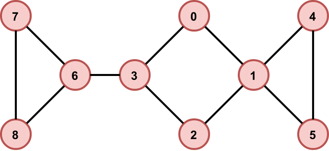
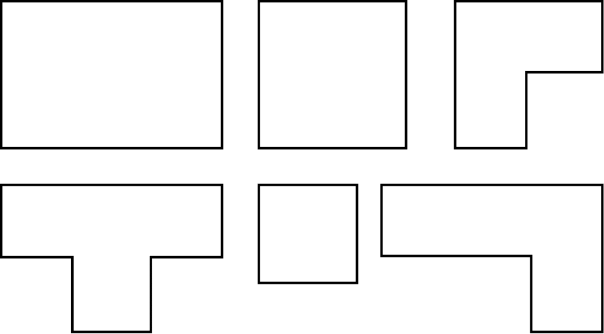
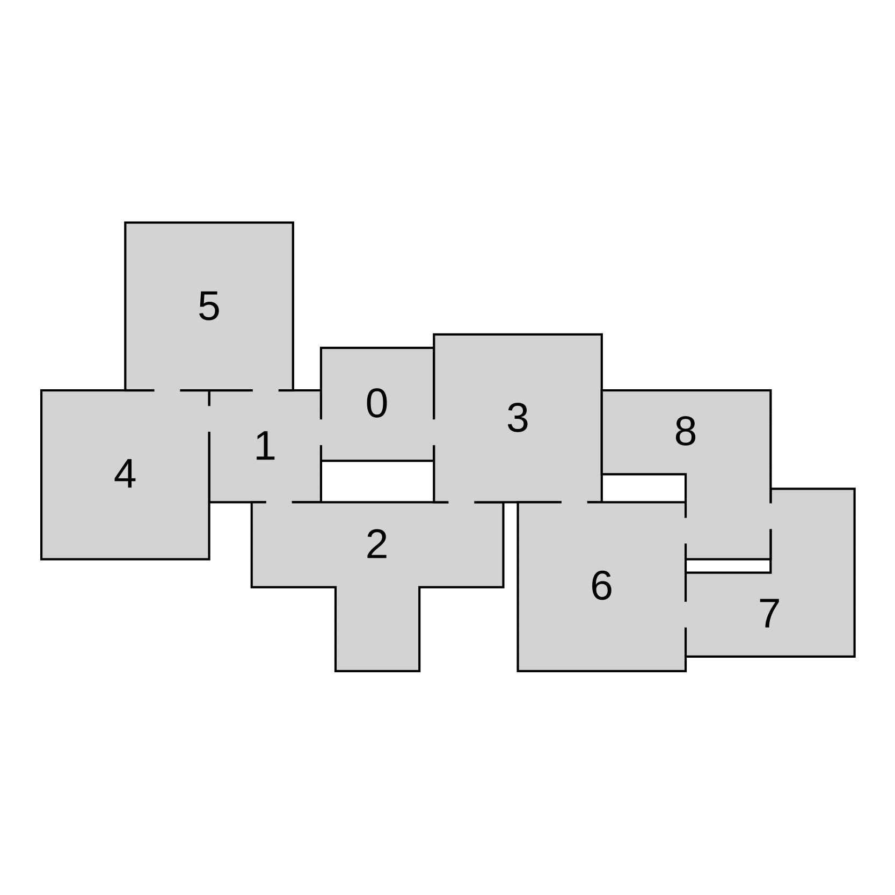
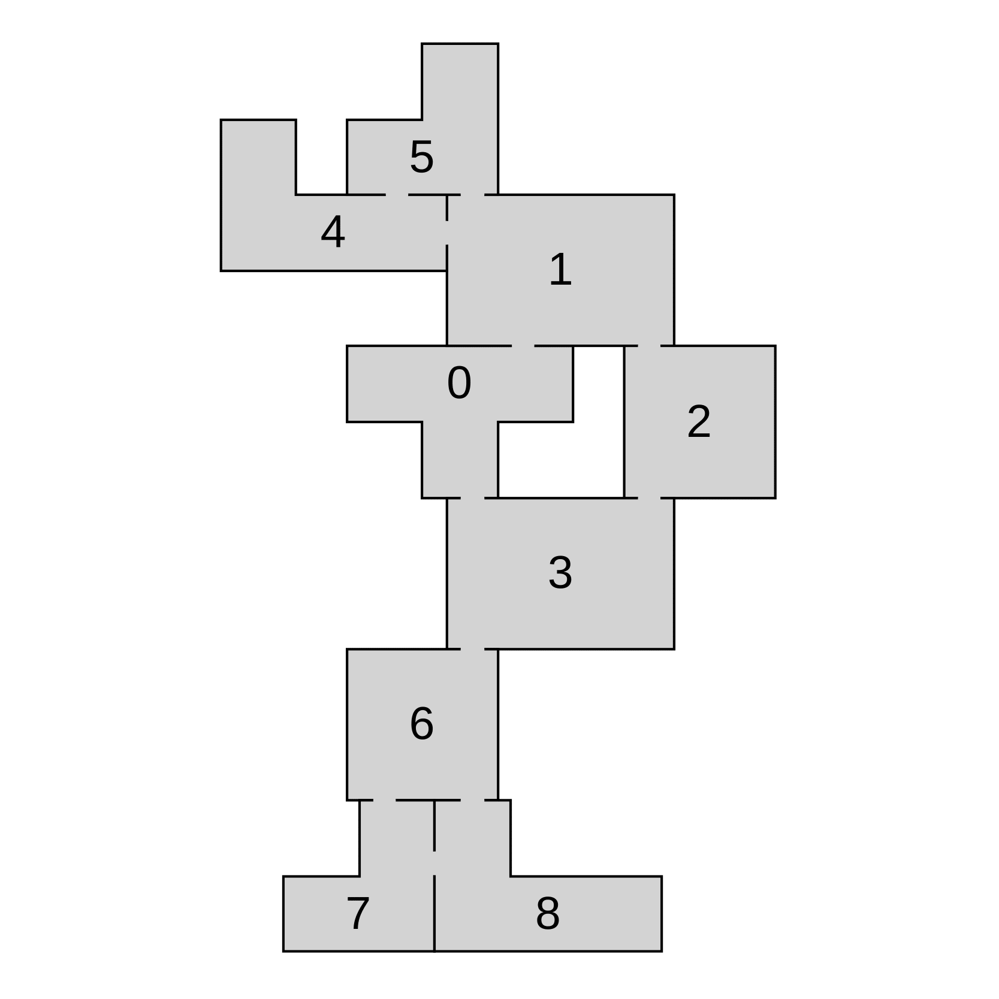
```

Through the connectivity graph, a game designer can easily affect the flow of gameplay. Do you want a single main path to a boss room with some optional side paths? Simply start with a path graph and then pick some nodes where the player can choose to either follow the main path or explore a side path with possible treasures and/or monsters waiting for them. Do you want a shortcut? Simply choose two nodes in the graph and add a shorter path that connects them. The possibilities are endless.

```grid|3
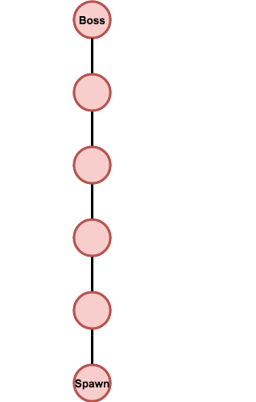
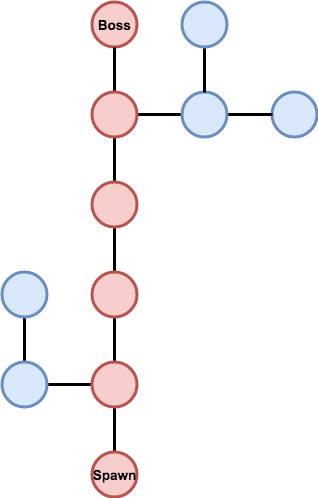
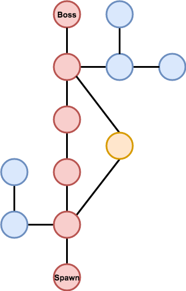
```

Not only does the algorithm allow game designers to control the high-level structure of generated layouts, it also provides ways to control the look of individual rooms and how they are connected to each other.

### Cycles in level graphs

Probably the most interesting feature of the whole algorithm is that you can have cycles in your level graphs. That is something that you usually don't see in graph-based generators because it's really hard to implement performance-wise.

### Different room shapes for different rooms

I mentioned having a boos room at the end of the dungeon. But we do not want our boss room to look like every other room, right? The algorithm supports defining room shapes on a per-room basis. For example, we may have a spawn room and a boss room that should have their own sets of room shapes and then one generic set for other rooms.

```grid|2|Two layouts generated from an input graph that has a special room shape assigned to the room number 8.
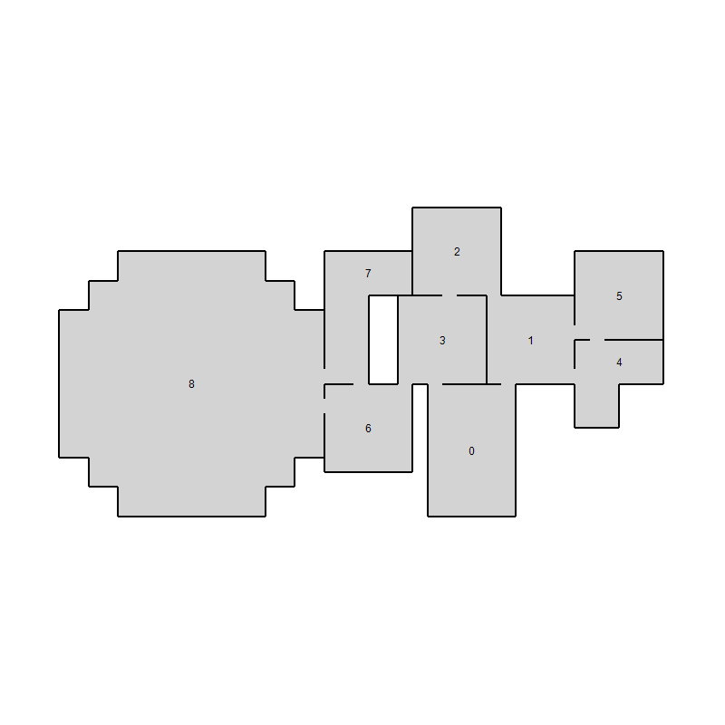
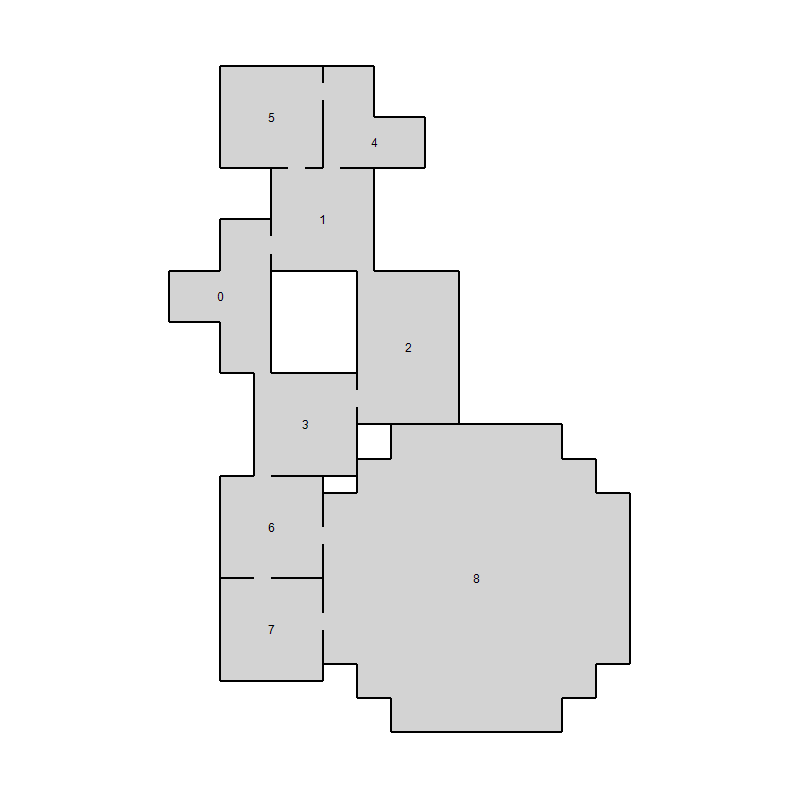
```

### Explicit door positions

Imagine having a really nice script for our boss encounter and that we need the player to enter the boss room from a specified tile. Or we may have a room template with some tiles reserved for walls or other obstacles. The algorithm allows game designers to explicitly specify possible door positions of individual room shapes.

But sometimes our goal may be the opposite. We may design our room templates in a way that they can have doors virtually anywhere. By doing that, we put fewer constraints on the algorithm, and it therefore often runs faster and generated layouts may feel less repetitive and more organic. For such situations, there is a possibility to simply specify length of the doors and how far from corners they should be. The distance from corners is kind of a compromise between manually specifying all doors and having doors anywhere.

```grid|2|(a) illustrates different types of door positions – the square room has 8 explicitly defined door positions, whilst the rectangular room uses lenght and distance from corners. (b) shows a simple generated layout with room shapes from (a).
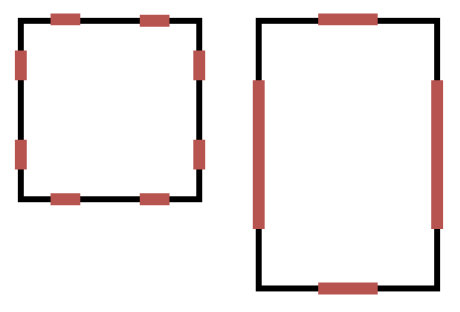
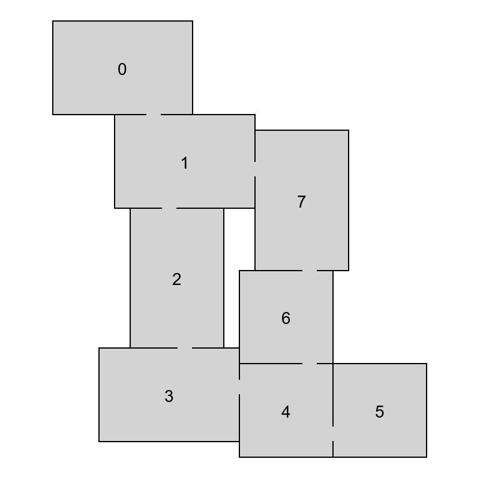
```

### Corridors between rooms

When we talk about dungeon levels, we often imagine rooms connected by narrow corridors. It would be tempting to think that connections in the input graph represent corridors. However, these connections aren't corridors – they just ensure that all neighbouring nodes can be connected directly by doors. If we want to have rooms connected by corridors, we have to insert a new node between all pairs of neighbouring rooms and pretend they are corridor rooms (with specific room shapes and door positions assigned).

```grid|2|Illustration of how we can modify the input graph to add corridors between rooms. (a) shows an input graph before adding corridor rooms. (b) shows an input graph created from (a) by adding a new room between all neigbouring rooms in the original graph.
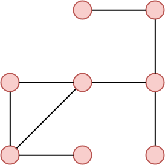
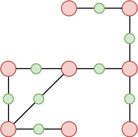
```

Unfortunately, by doing so we make the task a lot harder for the algorithm as we often end up with twice as many nodes. Therefore, I implemented a version of the algorithm that is aware of corridors and can reduce the performance loss of laying out corridor rooms.

## Examples

```grid|2|Several layouts generated with different sets of building blocks and corridors enabled.
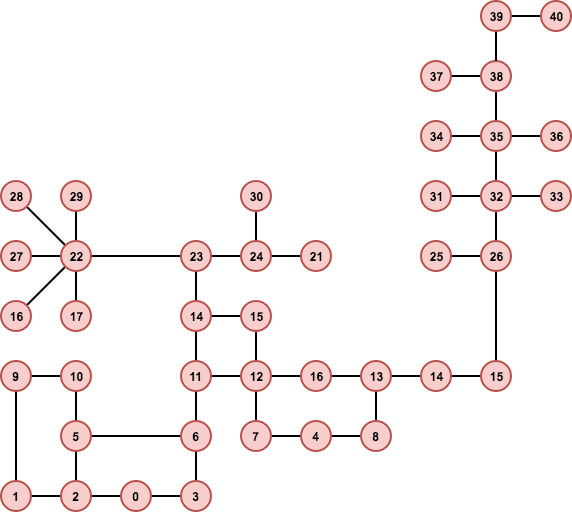

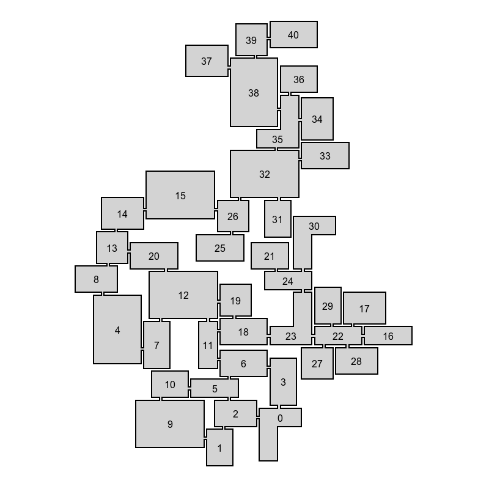
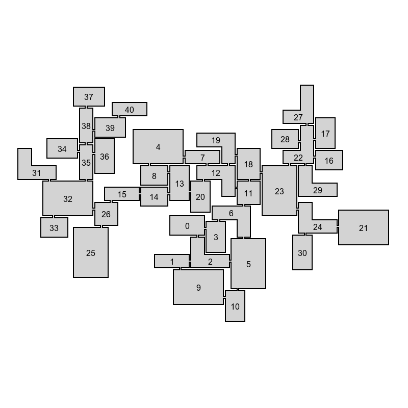
```

```grid|2|Several layouts generated with different sets of building blocks and corridors enabled.
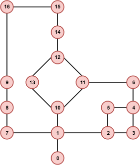
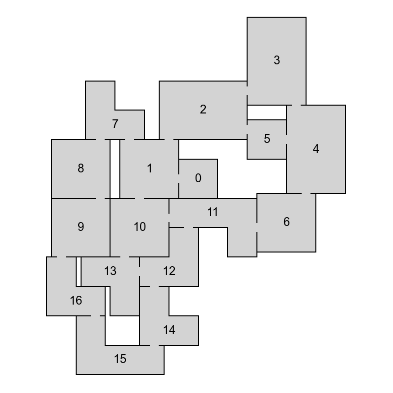
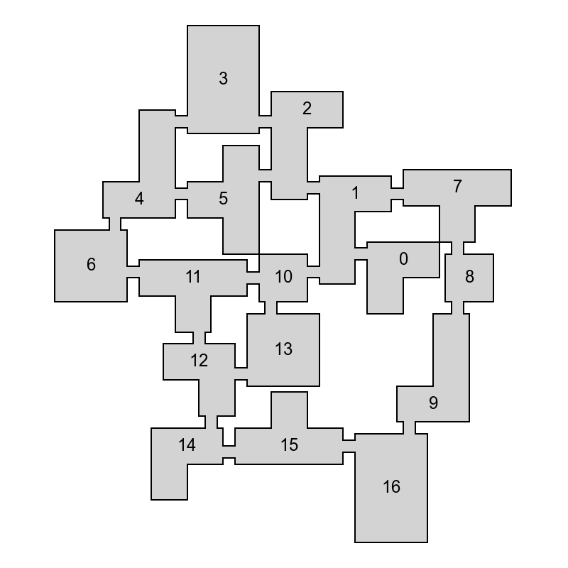
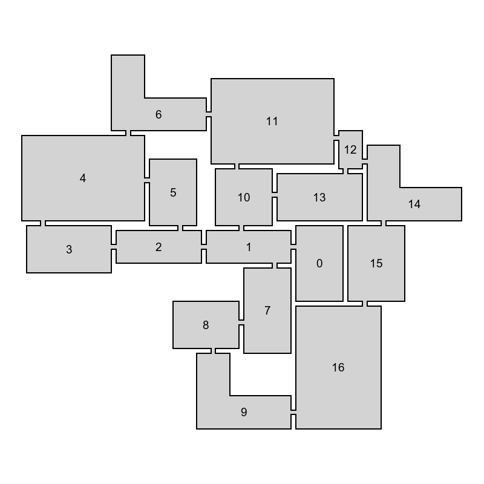
```

<EdgarDownloadSection />

## What's next

In the next post I'm going to describe how the algorithm works under the hood.

I'm also working on a Unity plugin for procedural dungeon generation that will incorporate this algorithm. The reason for that is that even though this algorithm can be directly used in Unity (as it is written in C#), the user experience is far from ideal. It is quite time-consuming to design room templates without a GUI and there is also quite a lot of programming needed to transform the output of the algorithm to a representation that is usable in a game.

As I'm not a game developer myself, the goal is to make the plugin good enough for someone else to use it. If everything goes well, I'll try to post updates when I have something interesting to present. I've also got quite a few ideas regarding the generator itself and testing its possibilities.