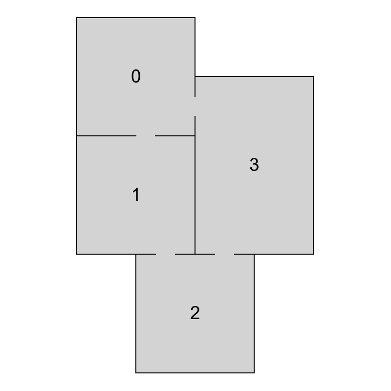
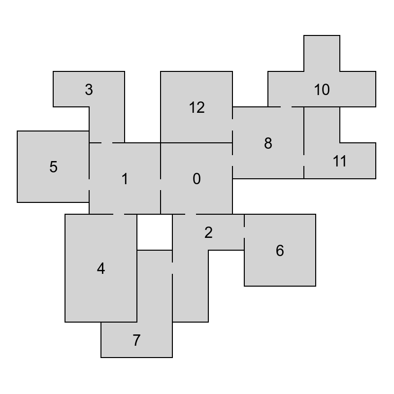
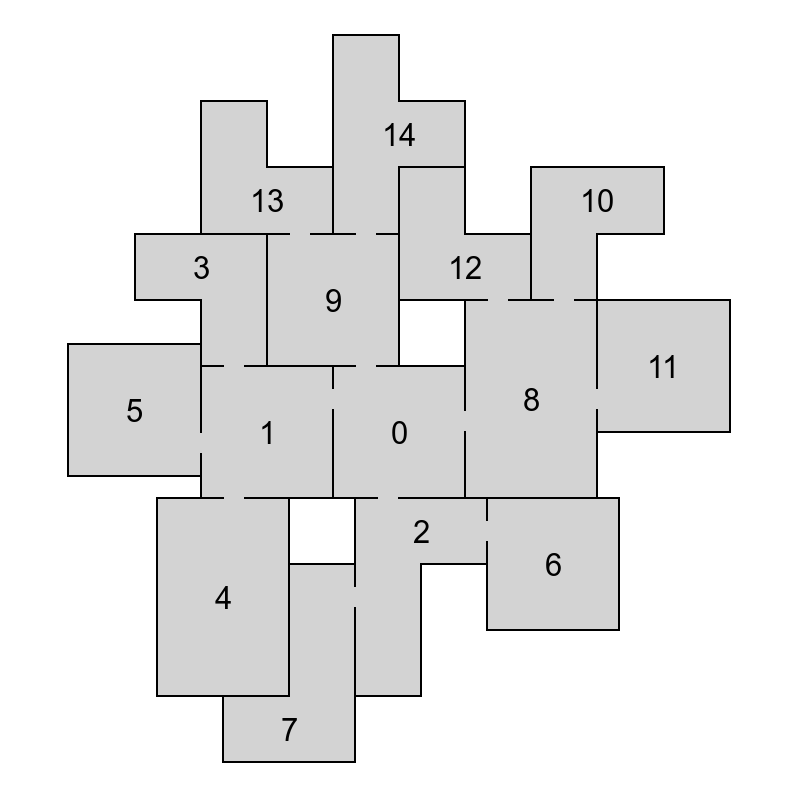

TODO: previous post link
TODO: code captions

In this blog post, I’ll describe the core ideas behind the algorithm that was presented in the previous post. Initially I thought I’d describe the core concepts together with all the main improvements that are needed to make the algorithm fast enough. However, it turned out that even the core concepts alone are probably more than enough for a single post. So I decided to cover performance improvements in a future post instead.

<BlogSeries slug={props.slug} />

## Motivation

Before going into the implementation, I want to show you the result of what we’re building here. The following video shows 30 different layouts generated from a single input graph with one set of building blocks. The algorithm always stops for 500 ms after generating a layout and then tries to generate another one.

`youtube: https://www.youtube.com/watch?v=pjSD6t7ISFg&ab_channel=OndrejNepozitek`

## How does it work

The goal of the algorithm is to assign a room shape and a position to each node in the graph in a way that no two room shapes intersect and that neighbouring rooms can be connected by doors.

One way to do that would be to try all possible combinations of room shapes and their positions. However, you can imagine that it would be very ineffective, and we would probably not be able to generate even layouts based on very simple input graphs.

Instead of searching through all possible combinations, the algorithm computes how can individual rooms be correctly connected (so-called configuration spaces) and uses that information to guide the search. Unfortunately, even with this information, it is still quite difficult to find a valid layout. Therefore, we use a probabilistic optimization technique (simulated annealing in our case) to efficiently explore the search space. And to further speed up the optimization, we break the input problem to smaller and easier sub-problems. This is done by decomposing the graph into smaller parts (called chains) and then laying them out one at a time.

## Configuration spaces

For a pair of polygons, one fixed and one free, a configuration space is a set of such positions of the free polygon that the two polygons do not overlap and can be connected by doors. When working with polygons, each configuration space can be represented by a possibly empty set of lines and can be computed with basic geometric tools.

```grid|2|Configuration spaces. (a) shows the configuration space (red lines) of the free square with respect to the fixed l-shaped polygon. It defines all the locations of the center of the square such that the two blocks do not intersect and are in contact. (b) shows the intersection (yellow dots) of configuration spaces of the moving square with respect to the two fixed rectangles.


```

Following algorithm is used to compute the configuration space of two blocks, one being fixed and the other one being allowed to move. We pick a reference point on the moving block and consider all locations in R2 such that, if the polygon is moved in a way that the reference point is placed at that location, both the moving block and the fixed block contact each other but do not intersect. The set of all these points forms the configuration space of the two blocks (image above – left). To get the configuration space of a moving block with respect to two or more fixed blocks, the intersection of the individual configuration spaces is computed (image above – right).

The algorithm utilizes configuration spaces in two ways. First, instead of trying random positions of individual rooms, we use configuration spaces to find positions that lead to as many neighbouring rooms being connected by doors as possible. This is done by getting the maximum non-empty intersection of configuration spaces of neighbours. Second, we use configuration spaces to check if all pairs of neighbouring rooms can be connected by doors. This is done by checking if a room’s position is contained in the configuration space of all its neighbours.

Because room shapes are not changed during runtime, we can precompute the configuration spaces of all pairs of room shapes before the algorithm starts. By doing so, we significantly speed up the whole algorithm.

## Incremental layout

When solving a complex problem, one possible approach is to divide it into smaller and easier sub-problems, and solve them instead. And that’s exactly what we do with the problem of laying out individual rooms. Instead of trying to lay out all the rooms at once, we decompose the input graph into smaller sub-graphs and then try to lay them out one at a time. Authors of the original algorithm call these sub-graphs “chains” because the idea is that graphs, where each node has at most two neighbours, are relatively easy to lay out.

Our final output layout is always a single connected component, hence there’s no benefit in laying out separate components and then trying to join them, as the joining process can be quite difficult. Instead, after laying out a chain, the next chain to connect is always one that’s connected to already laid out vertices.

```csharp lineNumbers
$caption:A pseudocode showing an incremental approach to finding a valid layout.
Layout GenerateLayout(inputGraph) {
    var emptyLayout = new Layout();
    var stack = new Stack<Layout>();
    stack.Push(emptyLayout);

    while(!stack.Empty()) {
        var layout = stack.Pop();
        var nextChain = GetNextChain(layout, inputGraph);
        Layout[] partialLayouts = AddChain(layout, nextChain);

        if (!partialLayouts.Empty()) {
            if (IsFullLayout(partialLayouts[0])) {
                return partialLayouts[0];
            } else {
                stack.Push(partialLayouts);
            }
        }
    }

    return null;
}
```

The pseudocode above shows the implementation of incremental layout. In each iteration of the algorithm (lines 6 – 18), we first take the last layout from the stack (line 7) and compute which chain should be added next (line 8). This can be simply done by storing the number of the last chain that was added to each partial layout. The following step is to add the next chain to the layout (line 9), generating multiple extended layouts and storing them. If the extension step fails, no new partial layouts are added to the stack and the algorithm has to continue with the last stored partial layout. We refer to this situation as backtracking because the algorithm cannot extend the current partial layout and has to go back and continue with a different stored layout. It is usually needed when there is not enough space to connect additional chains to already laid out vertices. Backtracking is also the reason why we always try to generate multiple extended layouts (line 9). Otherwise, we would have nothing to backtrack to. The process terminates after we generate a full layout or the stack is empty.

```grid|3



```

```grid|2|Incremental layout. (b) and (c) show two partial layouts after laying out the first chain. (d) shows a full layout after extending (b) with the second chain. (e) shows a full layout after extending (c) with the second chain.


```

To decompose a graph into chains, we have to find a planar embedding of the input graph, which is a drawing on the plane where edges intersect only at their endpoints. That embedding is then used to get all the faces of the graph. The basic idea of the decomposition is that cycles are harder to lay out because there are more constraints on the nodes. Therefore, it is attempted to put cycles to the beginning of the decomposition, thus making sure they are processed as soon as possible and the chance of backtracking in later phases of the algorithm is decreased. The first chain in the decomposition is formed by the smallest face of the embedding and following faces are then added in a breadth-first search ordering. If there are more faces to choose from, the smallest one is used first. When there are no faces left, remaining acyclic components are added. In Figure 4 we can see an example of a chain decomposition that is obtained by following these steps.

```grid|2|Chain decomposition. (b) shows an example how can be (a) decomposed into chains. Each color represents one chain. Number show in what order were the chains created.


```

```grid|2|Backtracking. (b) shows an example of a bad partial layout because there is not enough space to connect nodes 0 and 9. Backtracking to a different partial layout (c) is need to generate a full layout (d).




```

## Simulated annealing

[Simulated annealing](https://en.wikipedia.org/wiki/Simulated_annealing) is a probabilistic optimization technique whose goal is to explore the space of possible layouts. It was chosen by the authors of the original paper because they had found it useful in similar situations before. When implementing the algorithm, I decided to use the same method because I wanted to start with something that already proved to be successful when solving this problem. However, I think that it could be replaced with a different method and the library is written in a way that the process of changing the method should be quite simple.

Simulated annealing operates by iteratively considering small changes to the current configuration, or layout. That means that we create a new configuration by randomly picking one node and changing its position or shape. If the new configuration improves the energy function, it’s always accepted. Otherwise, there’s a small probability of accepting the configuration anyway. The probability of accepting worse solutions decreases over time. The energy function is constructed in a way that it heavily penalizes nodes that intersect and neighbouring nodes that do not overlap.

$$
E = e^{\frac{A}{\omega}} e^{\frac{D}{\omega}} – 1
$$

$A$ is the total area of intersection between all pairs of blocks in the layout. $D$ is the sum of squared distances between the centers of pairs of blocks that are neighbours in the input graph, but which are not in contact. The value of $\omega$ affects how often is simulated annealing allowed to move to a worse configuration, and is derived from the average area of building blocks.

After picking a node to be changed, we either change its shape or its position. How do we choose a new position? We could pick it at random but that would often make the energy function worse and the algorithm would converge very slowly. Are we able to choose a position that will most likely improve the energy function? Do you see where I’m heading? We’ll use configuration spaces to choose a position that satisfies constraints of as many neighbouring rooms as possible.

Changing the shape is then only a matter of randomly picking one of available room shapes. The algorithm currently does not try to decide which shape has a better chance of leading us to a valid layout. However, it may be interesting to try that out and see if improves the speed of the algorithm.

```csharp lineNumbers
$caption:A pseudocode of a method that’s responsible for laying out a single chain of rooms using simulated annealing.
List<Layout> AddChain(chain, layout) {
    var currentLayout = GetInitialLayout(layout, chain);
    var generatedLayouts = new List<Layout>();

    for (int i = 1; i <= n, i++) {
        if (/* we already generated enough layouts */) {
            break;
        }

        for (int j = 1; j <= m, j++) {
            var newLayout = PerturbLayout(currentLayout, chain);

            if (IsValid(newLayout)) {
                if (DifferentEnough(newLayout, generatedLayouts)) {
                    generatedLayouts.Add(newLayout);
                }
            }

            if (/* newLayout better than currentLayout */) {
                currentLayout = newLayout;
            } else if (/* probability depending on how bad is the energy of newLayout */) {
                currentLayout = newLayout;
            }
        }

        /* decrease the chance of accepting worse layouts */
    }

    return generatedLayouts;
}
```

To speed up the whole process, we try to find an initial configuration with a low energy. To do that, we construct a breadth-first search ordering of nodes in the current chain, starting from the ones that are adjacent to already laid out nodes. Ordered nodes are then placed one at a time, choosing a position from the configuration space with the lowest energy. We don’t do any backtracking here – it’s a simple greedy process.

## Bonus video

The following video shows layouts generated from the same input graph as in the first video. This time, however, it shows the incremental approach. You can see how the algorithm adds chains of nodes one by one. You can also see that there are sometimes 2 consecutive partial layouts with the same number of nodes. That happens when the algorithm backtracks. It first tries to add another chain to the first partial layout, fails, and then tries a different partial layout.

`youtube: https://www.youtube.com/watch?v=28Ne6fHw2ss&ab_channel=OndrejNepozitek`

<EdgarDownloadSection />