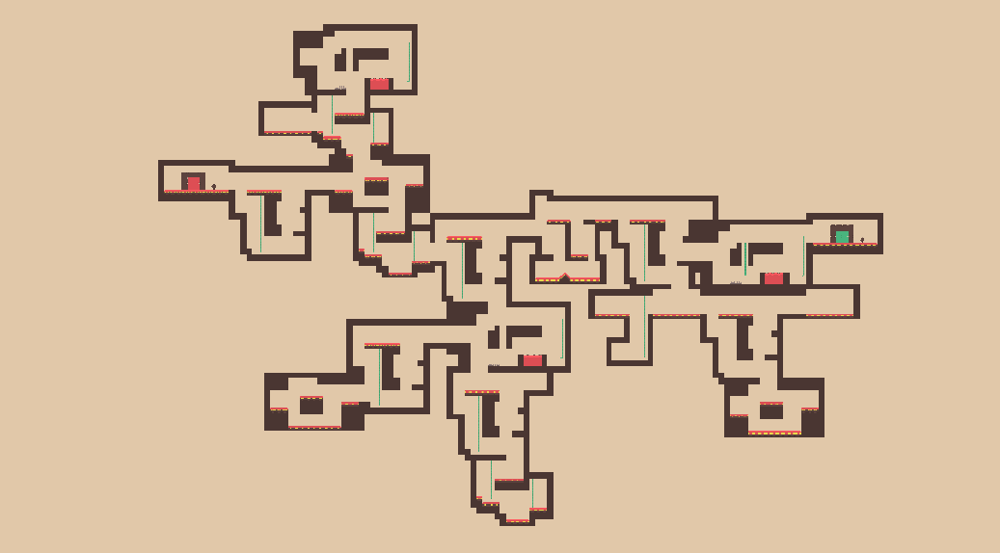
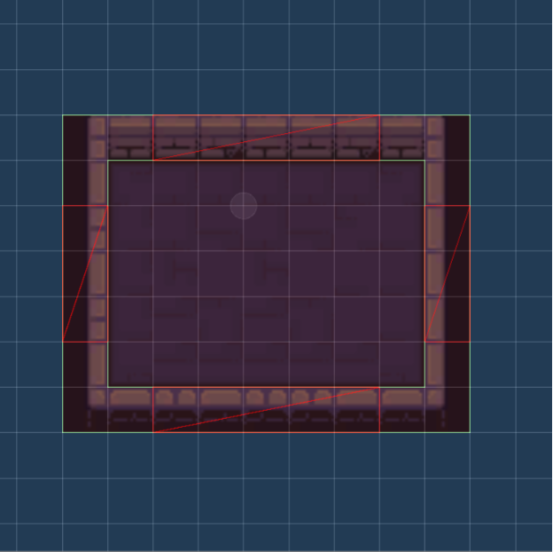
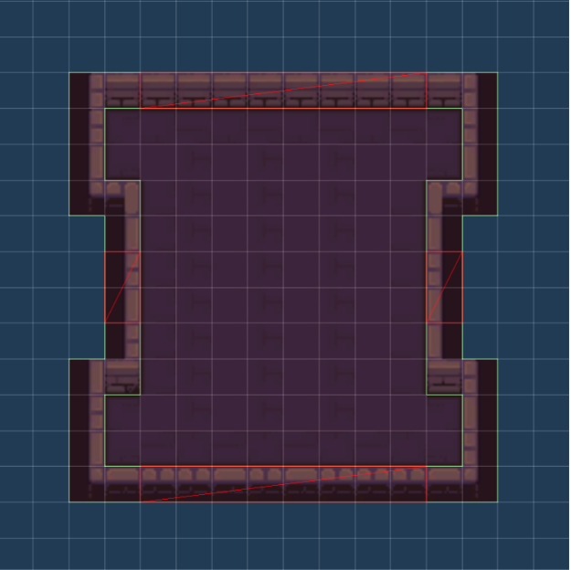
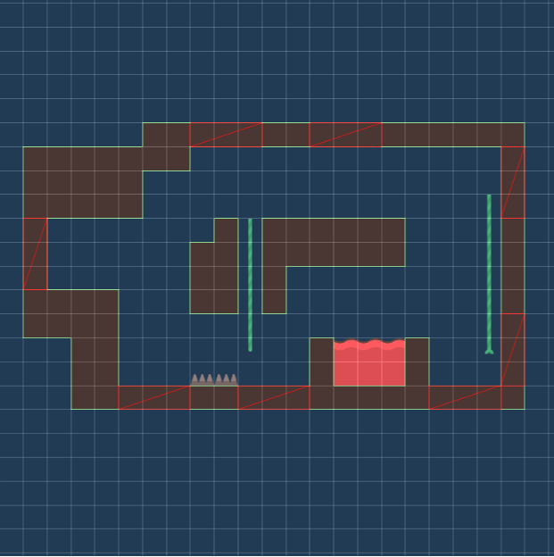
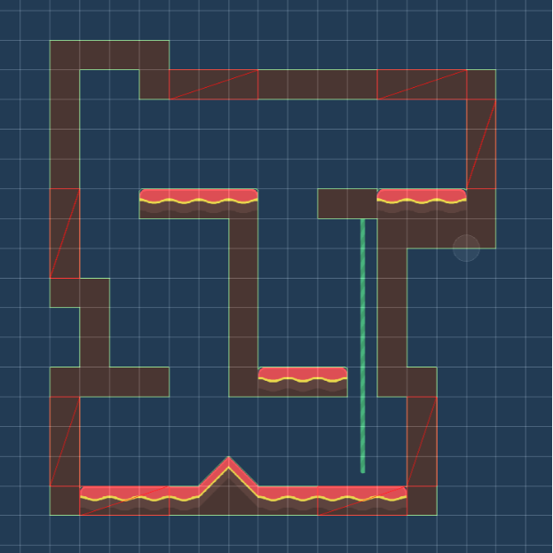
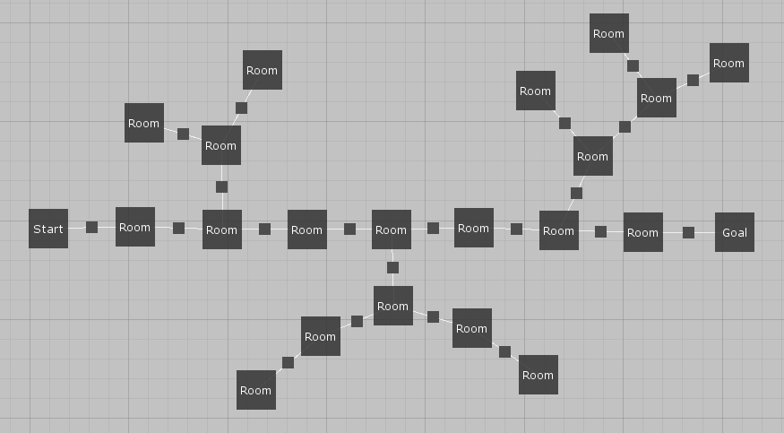
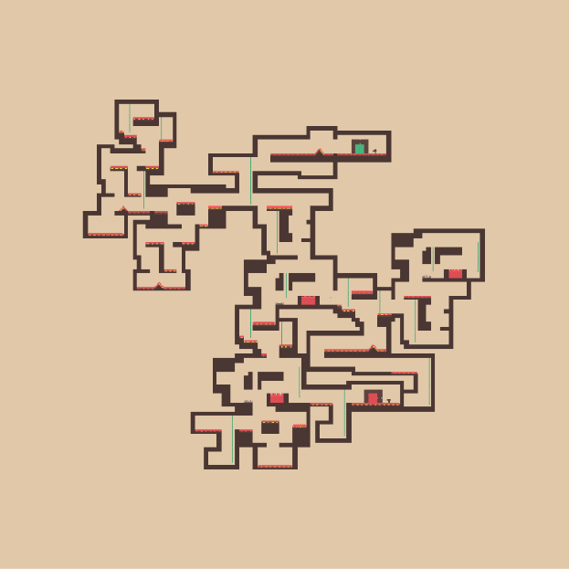
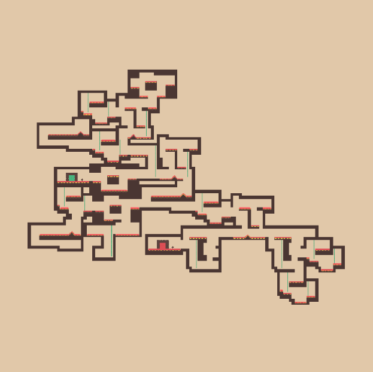
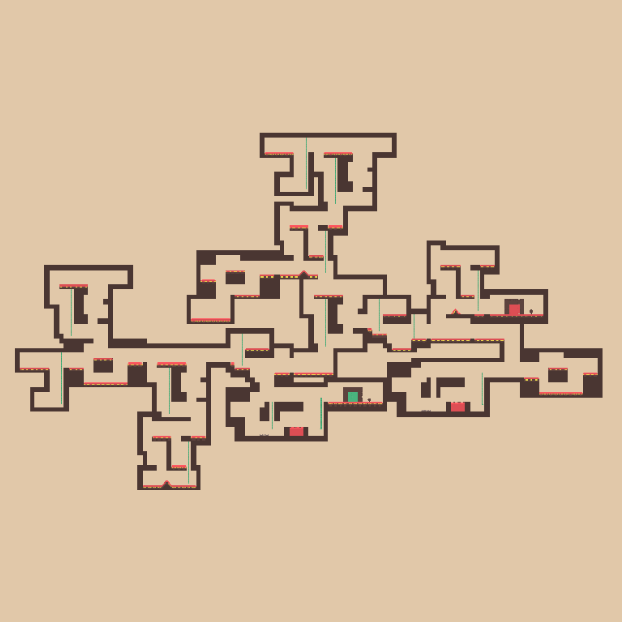
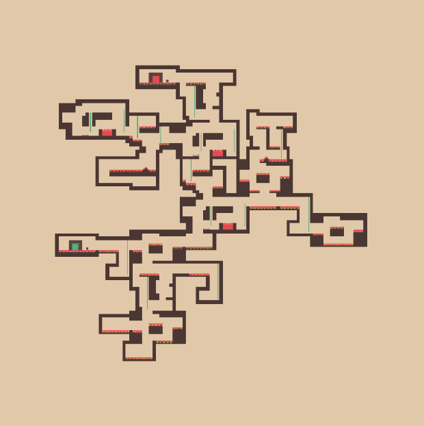

In this blog post, I’ll showcase my early prototype of a procedural platformer generator. The generator is not a standalone algorithm but rather a modification of my graph-based dungeon generator. I suggest first reading about the dungeon generator as all the core ideas remain the same.

<BlogSeries slug={props.slug} />

The reason for writing this post is that two redditors asked me whether it’s possible to use my algorithm to generate platformer levels. I was quite sceptical at first but decided to give it a try. As a result, I implemented a simple modification of the algorithm that can (with some limitations) generate platformer levels based on a given level graph that describes the high-level structure of all generated levels.




## Dungeons vs platformers

The original dungeon generator algorithm is based on three core concepts – configuration spaces are used to describe valid relative positions of pairs of rooms; simulated annealing is used to find valid layouts; and the whole problem is divided into smaller sub-problems that are solved one after another.

The idea behind simulated annealing is that we take a room which is not correctly connected to its neighbours and find a position such that minimizes the number of not connected neighbours. For this step to work, we need to design our room templates such that there are plenty of ways of connecting them to neighbouring rooms.

```grid|2|Dungeon room templates with possible door positions in red. These room templates are quite good for the generator as there are relatively many options of connecting them to neighbouring rooms.


```

To make the whole problem easier, we can add corridors to our dungeons. With corridors, there are more possibilities of connecting individual rooms and also a smaller chance of rooms overlapping because the byproduct of using corridors is that non-corridor rooms are further apart from each other.

But with platformers, the whole situation si different. Room templates will usually have fewer possible door positions/connections, and we also can’t use corridors. My hypothesis was that the algorithm would struggle on level graphs containing cycles because cycles are hard even when working with dungeons. And it turned out to be true – it often took the algorithm tens of seconds to find a valid platformer level. **So the goal was to make the algorithm work at least with acyclic level graphs**.

```grid|2|Platformers room templates with possible door position in red. These room templates are harder to connect to each other – especially when trying to lay out cycles.


```

## Implementation

The main difference with the original algorithm is that I replaced simulated annealing with a very simple greedy algorithm. The whole algorithm now works like this:

First we decompose a given level graph into smaller parts (called chains in the original algorithm). When we worked with cycles, we tried to first lay out these cycles and only later handle remaining acyclic components. Without cycles, the situations is much simpler. We can simply start with an arbitrary leaf node and then do a breadth-first search to group nodes into smaller chains.

The chains will be used to guide us through the process of laying out individual nodes. We will start with the first chain and lay out one node after another in the order in which they appear in the chain. If we’re not able to lay out a node, we reset all the nodes in the current chain and start over. After we lay out the whole chain, we move to another chain, repeating the process until all rooms have their room templates and positions assigned.

```csharp
public Layout EvolveChain(initialLayout, chain) {
    for (int i = 0; i < NumberOfAttemptsTotal; i++) {
        var layout = initialLayout.Clone();

        foreach (var node in chain) {
            if (!TryLayoutNode(layout, node)) {
                break;
            }
        }

        if (/* complete layout generated */) {
            return layout;
        }
    }

    return null;
}
```

The reason for decomposing level graphs into smaller parts is that if we’re unable to lay out a node because of an unlucky positioning of previous nodes, we don’t have to throw everything away and start over. We just reset the current chain and try again. And if we’re still not lucky after several tries, only then we do one more step backwards and backtrack to the previous chain.

The process of laying out individual nodes is very simple. We pick a random room template from its pool of available room templates and then pick a random position that correctly connects the node to its already laid out neighbours. After that, we have to check if the room doesn't overlap any other rooms. We repeat these steps until we find a valid room position of the node, or we reach the maximum number of attempts.

```csharp
public bool TryLayoutNode(layout, node) {
    for (int i = 0; i < NumberOfAttemptsPerNode; i++) {
        var roomTemplate = // get random room template for node
        var position = // get random position where node is correctly connected to neighbours

        if (/* node does not overlap any other room */) {
            // set roomTemplate nad position for node
            return true;
        }
    }

    return false;
}
```

## Results



```grid|2|Generated layouts, tileset by @KenneyNL




```

<EdgarDownloadSection />